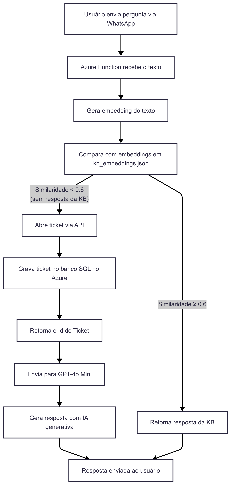

# 🤖 Projeto de Atendimento Inteligente via WhatsApp com IA e API de Tickets

Este projeto é um MVP de um sistema inteligente de atendimento ao cliente via **WhatsApp**, utilizando **OpenAI**, **Azure Functions** e uma **API de tickets em .NET**. Ele é capaz de interpretar mensagens, buscar respostas por similaridade semântica e, se necessário, abrir tickets automaticamente.

---

## 📌 Como Funciona

1. O usuário envia uma pergunta via WhatsApp
2. A Azure Function recebe o texto e gera um embedding
3. O embedding é comparado com os da base (`kb_embeddings.json`)
4. Se a similaridade for suficiente (≥ 0.6), retorna a resposta da KB
5. Caso contrário, é aberto um ticket via API
6. A API grava o ticket em um banco de dados SQL no Azure e retorna o Id
7. Se a pergunta não foi respondida pela KB, então usa o GPT-4o Mini para responder com IA generativa informando o Id do Ticket aberto

---

## 🧠 Visão Geral da Arquitetura



---

## ✨ Tecnologias Utilizadas

- **🧩 Frontend e Integração**
  - 💬 **WhatsApp** (via Twilio Webhook)
  - ⚡ **Azure Functions (Python)** – backend escalável para processamento de mensagens
  - 🚀 **GitHub Actions + Azure (CI/CD)** – deploy contínuo automatizado

- **🧠 Inteligência Artificial**
  - 🤖 **OpenAI GPT-4o-mini** – geração de respostas com linguagem natural
  - 🧬 **OpenAI Embeddings** (`text-embedding-3-small`) – vetorização de textos
  - 📈 **Similaridade por cosseno** – para comparação semântica entre perguntas e respostas

- **🗄️ Persistência**
  - ☁️ **Azure Blob Storage** – armazenamento da base vetorizada (`kb_embeddings.json`)
  - 🗃️ **Azure SQL Database** – persistência dos tickets
  - 🛠️ **API de Tickets** – construída com C# e .NET 9

- **🧪 Testes e Desenvolvimento**
  - 🔬 **Postman** e **Scalar** – testes de API REST
  - 🧑‍💻 **VS Code** com **Azure Tools** – ambiente de desenvolvimento principal
  - 🐍 **Python 3.10+** – linguagem da Azure Function
  - ⚙️ **C# e .NET 9** – linguagem da API REST

- **🧰 Outros**
  - 🔍 **Azure Cognitive Search** – usado inicialmente com busca tradicional (etapa removida ao final)


---
## 🧪 Como Testar no WhatsApp

1. **Abra o WhatsApp** e envie a mensagem **join correctly-atom** para o número **+14155238886** (Twilio).
2. Você receberá a resposta:
   > **Twilio Sandbox:** ✅ You are all set! The sandbox can now send/receive messages from whatsapp:+14155238886. Reply stop to leave the sandbox any time.

3. **Knowledge Base (KB)**:

   3.1. Envie uma pergunta igual ou semelhante a algo que esteja na KB.  
   3.2. Você receberá uma resposta compatível com o que está na base.  

   3.3. **Exemplo de pergunta e resposta da KB:**  
   ```json
   {
       "pergunta": "Como faço para criar uma nova senha?",
       "resposta": "Para redefinir sua senha, vá até a tela de login e clique em 'Esqueci minha senha'."
   }
   ```

4. **Abertura de Ticket (quando Similaridade < 0.6)**:

   4.1. Envie uma pergunta diferente das que estão na KB.  
   4.2. Você receberá uma resposta gerada pela OpenAI.  
   4.3. Um ticket será automaticamente aberto com a descrição da dúvida.  
   4.4. Você receberá também o número do ticket criado.  

   4.5. **Exemplo de pergunta e resposta com abertura de ticket:**  
   ```json
   {
       "pergunta": "Como faço login no aplicativo de finanças?",
       "resposta": "Olá! Entendo que você precisa de ajuda para fazer login no aplicativo de finanças. Infelizmente, não tenho as informações exatas sobre esse processo no momento. Para garantir que você receba a assistência adequada, vou abrir um chamado para que nossa equipe possa esclarecer essa dúvida para você o mais rápido possível. 

       Se precisar de mais alguma coisa, estou aqui para ajudar!
       Ticket criado com ID: 15"
   }
   ```
---

## 🧪 Testes de API

A API de Tickets foi construída em C# com .NET 9 e exposta por meio de endpoints RESTful. Aqui estão os exemplos para testes:

> **Status disponíveis:**
> - `1` = **Pendente**
> - `2` = **EmAndamento**
> - `3` = **Concluido**

---

### 🔹 `GET /api/ticket`
**Recupera todos os tickets.**

**Exemplo de Requisição:**
```http
GET https://aisupportapi-f0frfeh8abc9g2ey.brazilsouth-01.azurewebsites.net/api/ticket
```

**Response 200:**
```json
[
  {
    "id": 15,
    "category": "Dúvida",
    "description": "Nome: CassIA Technology | whatsapp:+5500000000000 | Mensagem: Como faço login no aplicativo de finanças?",
    "status": "Pendente"
  }
]
```

---

### 🔹 `POST /api/ticket`
**Cria um novo ticket.**

**Exemplo de Requisição:**
```http
POST https://aisupportapi-f0frfeh8abc9g2ey.brazilsouth-01.azurewebsites.net/api/ticket
Content-Type: application/json
```

**Body:**
```json
{
  "category": "Dúvida",
  "description": "Está pedindo para atualizar o aplicativo, como faço isso?",
  "status": 1
}
```

**Response 201:**
```json
{
  "id": 13,
  "category": "Dúvida",
  "description": "Está pedindo para atualizar o aplicativo, como faço isso?",
  "status": "Pendente"
}
```

---

### 🔹 `PUT /api/ticket/{id}`
**Atualiza um ticket existente.**

**Exemplo de Requisição:**
```http
PUT https://aisupportapi-f0frfeh8abc9g2ey.brazilsouth-01.azurewebsites.net/api/ticket/13
Content-Type: application/json
```

**Body:**
```json
{
  "category": "Dúvida",
  "description": "Está pedindo para atualizar o aplicativo, como faço isso?",
  "status": 2
}
```

**Response 200:**
```json
{
  "mensagem": "Ticket Id 13 editado com sucesso!"
}
```

---

### 🔹 `DELETE /api/ticket/{id}`
**Remove um ticket.**

**Exemplo de Requisição:**
```http
DELETE https://aisupportapi-f0frfeh8abc9g2ey.brazilsouth-01.azurewebsites.net/api/ticket/13
```

**Response 200:**
```json
{
  "mensagem": "Ticket Id 13 excluido com sucesso!"
}
```

---
## 🧪 Testando a Function App localmente

Siga os passos abaixo para executar e testar a Azure Function App localmente:

### 1. Pré-requisitos

- Python 3.10 ou superior
- Azure Functions Core Tools (`func`)
- Ambiente virtual configurado (`aisupportvenv`)
- Dependências instaladas via `requirements.txt`

```bash
# Ativar o ambiente virtual
.\aisupportvenv\Scripts\Activate

# Instalar as dependências
pip install -r requirements.txt
```

---

### 2. Rodar a Function App local

Use o comando abaixo para iniciar a aplicação:

```bash
func start
```

A função ficará disponível localmente em:

```
http://localhost:7071/api/responder_mensagem
```

---

### 3. Testar com Postman ou `curl`

#### Exemplo com `curl`:

```bash
curl http://localhost:7071/api/responder_mensagem ^
  --request POST ^
  --header "Content-Type: application/x-www-form-urlencoded" ^
  --data-urlencode "Body=Como redefinir minha senha?"
```

#### Exemplo com Postman:

- Método: `POST`
- URL: `http://localhost:7071/api/responder_mensagem`
- Body: `x-www-form-urlencoded`
  - Key: `Body`
  - Value: sua pergunta (ex: `Como redefinir minha senha?`)

---

### 4. Logs

Durante a execução, os logs no terminal exibirão:

- A pergunta recebida
- A similaridade calculada
- A fonte da resposta (KB ou OpenAI)
- A resposta final

---

### 5. Configuração de ambiente

Certifique-se de que o arquivo `local.settings.json` esteja presente na raiz do projeto com o seguinte conteúdo:

```json
{
  "IsEncrypted": false,
  "Values": {
    "FUNCTIONS_WORKER_RUNTIME": "python",
    "AzureWebJobsStorage": "UseDevelopmentStorage=true",
    "SEARCH_KEY": "<sua-chave-do-azure-search>",
    "OPENAI_API_KEY": "<sua-chave-da-openai>"
  }
}
```

> ℹ️ Substitua os valores em branco pelas suas chaves reais de API (mantidas em segredo e **nunca commitadas no GitHub**).
